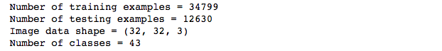
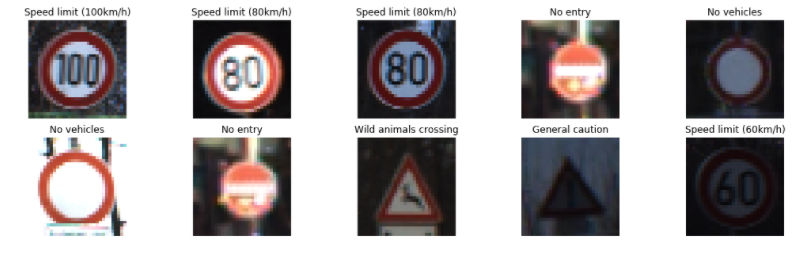
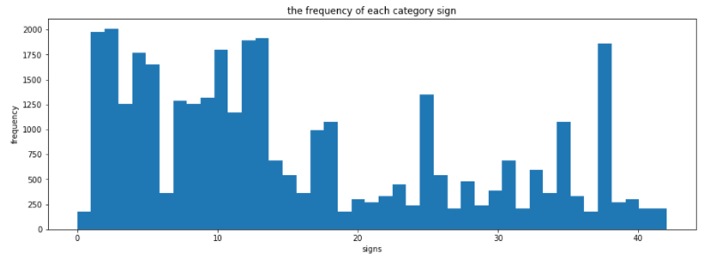
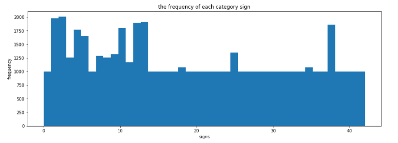
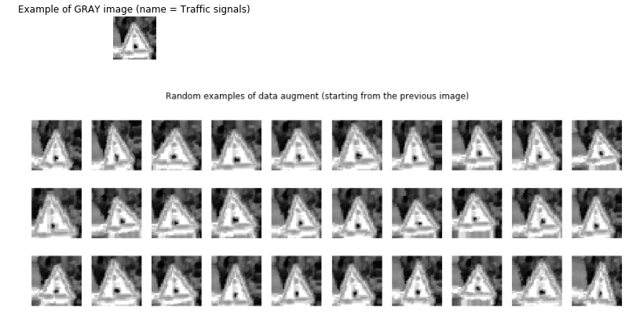
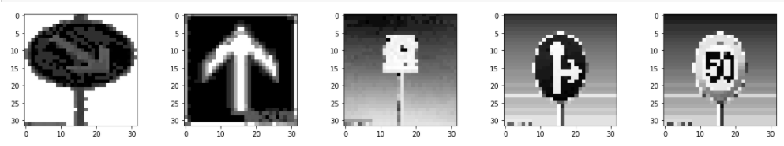
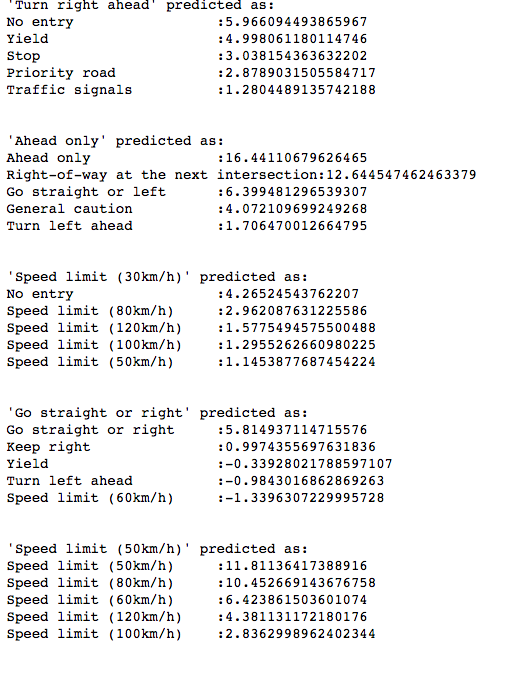

# 交通标志检测 

总共执行的操作如下
* 加载数据，包括训练集，验证集，测试集，[下载地址](https://s3-us-west-1.amazonaws.com/udacity-selfdrivingcar/traffic-signs-data.zip)

  ```python
  # Load pickled data
  import pickle

  # Fill this in based on where you saved the training and testing data
  training_file = 'traffic-signs-data/train.p'
  validation_file = 'traffic-signs-data/valid.p'
  testing_file = 'traffic-signs-data/test.p'

  with open(training_file, mode='rb') as f:
      train = pickle.load(f)
  with open(validation_file, mode='rb') as f:
      valid = pickle.load(f)
  with open(testing_file, mode='rb') as f:
      test = pickle.load(f)

  X_train, y_train = train['features'], train['labels']
  X_valid, y_valid = valid['features'], valid['labels']
  X_test, y_test = test['features'], test['labels']
  ```

  > 由下观察出一共有43个分类，且训练数据只有三万多个，数据量很小，所以后面考虑增加数据。
  >
  > 增加数据有两种方式，一是采集数据（困难），二是使用图片处理生成（简单），我选择的后者。

  

* 查看显示数据

  > 随机获取几张图片

  ```python
  # plotting traffic sign images
  fig, axes = plt.subplots(2, 5, figsize=(18, 5))
  ax_array = axes.ravel()
  for ax in ax_array:
      index = random.randint(0, len(X_test))
      ax.imshow(X_test[index])
      ax.axis("off")
      ax.set_title(id_to_name[y_test[index]])
  plt.show()
  ```

  

  > 使用直方图，查看图像的各个类别的分布情况

  ```python
  # calculate the frequency of each category sign
  def plot_y_train_hist():
      fig = plt.figure(figsize=(15, 5))
      ax = fig.add_subplot(1, 1, 1)
      hist=ax.hist(y_train, bins = n_classes)
      ax.set_title("the frequency of each category sign")
      ax.set_xlabel("signs")
      ax.set_ylabel("frequency")
      plt.show()
      return hist
  hist = plot_y_train_hist()
  ```

  

* 由上图知道数据分配不均匀，所以需要数据重采样，使样本个数分配均匀

  > 这里只是对相同的数据简单的复制，是样本数量小于1000的补齐到1000个。

  ```python
  # Generating bin centers
  bin_edges = hist[1]
  bin_centers = (bin_edges[1:]  + bin_edges[0:len(bin_edges)-1])/2
  for i in range(len(bin_centers)):
      if hist[0][i] < 1000 :
          train_data = [X_train[j] for j in range(len(y_train)) if y_train[j] == i]
          need_resample_num = int(1000 - hist[0][i])
          new_data_x = [np.copy(train_data[np.random.randint(len(train_data))]) for k in range(need_resample_num)]
          new_data_y = [i for x in range(need_resample_num)]
          X_train = np.vstack((X_train, np.array(new_data_x)))
          y_train = np.hstack((y_train, np.array(new_data_y)))
  print(X_train.shape)
  print(y_train.shape)
  plot_y_train_hist()
  ```

  

* 数据预处理

  > 输入的图像是RGB图像，对数据进行颜色空间转换，SCALE，归一化，直方图均衡化。
  >
  > 尝试过转换成其他的颜色空间，只有在转换为YUV颜色空间取Y通道的时候效果最好。

  ```python
  import cv2

  def preprocess_features(X, equalize_hist=True):
      normalized_X = []
      for i in range(len(X)):
          # Convert from RGB to YUV
          yuv_img = cv2.cvtColor(X[i], cv2.COLOR_RGB2YUV)
          yuv_img_v = X[i][:, :, 0]
          # equalizeHist
          yuv_img_v = cv2.equalizeHist(yuv_img_v)
          # expand_dis
          yuv_img_v = np.expand_dims(yuv_img_v, 2)
          normalized_X.append(yuv_img_v)
      # normalize
      normalized_X = np.array(normalized_X, dtype=np.float32)
      normalized_X = (normalized_X-128)/128
      # normalized_X /= (np.std(normalized_X, axis=0) + np.finfo('float32').eps)
      return normalized_X

  X_train_normmalized = preprocess_features(X_train)
  X_valid_normalized = preprocess_features(X_valid)
  X_test_normalized = preprocess_features(X_test)
  ```

* 使数据和顺序无关，shuffle

  ```python
  from sklearn.utils import shuffle

  X_train_normmalized, y_train = shuffle(X_train_normmalized, y_train)
  ```

* 由于数据量不够，使用keras生成数据

  > 可以使用tensorflow或cv2的图像翻转，亮度调整和比例的缩放等对图像进行变化，以增加数据。
  >
  > 但是keras默认封装了这些功能，用起来更方便。

  ```python
  from keras.preprocessing.image import ImageDataGenerator

  # ImageDataGenerator
  image_datagen = ImageDataGenerator(rotation_range = 10.,
                                     zoom_range = 0.2,
                                     width_shift_range =  0.08,
                                     height_shift_range = 0.08
                                    )

  # take a random image from the training set
  index = np.random.randint(0, len(X_train_normmalized))
  img = X_train_normmalized[index]

  # plot the original image
  plt.figure(figsize=(1, 1))
  plt.imshow(np.squeeze(img), cmap="gray")
  plt.title('Example of GRAY image (name = {})'.format(id_to_name[y_train[index]]))
  plt.axis('off')
  plt.show()

  # plot some randomly augmented images
  fig, ax_array = plt.subplots(3, 10, figsize=(15, 5))
  for ax in ax_array.ravel():
      images = np.expand_dims(img, 0)
      # np.expand_dims(img, 0) means add dim
      augmented_img, _ = image_datagen.flow(np.expand_dims(img, 0), np.expand_dims(y_train[index], 0)).next()
      #augmented_img=preprocess_features(augmented_img)
      ax.imshow(augmented_img.squeeze(), cmap="gray")
      ax.axis('off')
  plt.suptitle('Random examples of data augment (starting from the previous image)')
  plt.show()
  ```


  > 从生成的结果可以看出，生成的效果还是很不错 ，对原图像惊醒了一下放大、缩小、旋转，但是整个图像的形状进行了保留。



* 构建神经网络架构，训练，验证，保存模型参数

  > 构建的神经网络结构如下：

  | 层         | 描述                          |
  | ---------- | ----------------------------- |
  | 输入层     | 32x32x1 GRAY image            |
  | 卷积层 5x5 | 1x1 stride, outputs 32x32x32  |
  | 激活函数   | relu                          |
  | 池化层     | 2x2 stride,  outputs 16x16x32 |
  | 卷积层 5x5 | 1x1 stride, outputs 16x16x32  |
  | 激活函数   | relu                          |
  | 池化层     | 2x2 stride,  outputs 8x8x32   |
  | 全连接层   | input 2048, output 256        |
  | 全连接层   | input256, output 128          |
  | 全连接层   | input256, output 43           |
  | 激活函数   | softmax                       |

  ```python
  from tensorflow.contrib.layers import flatten
  import tensorflow as tf

  EPOCHS = 35
  BATCHES_PER_EPOCH = 500
  BATCH_SIZE = 256
  rate = 0.001

  def MyNet(x, keep_prob):
      # Arguments used for tf.truncated_normal, randomly defines variables for the weights and biases for each layer
      mu = 0
      sigma = 0.1
      
      # Layer 1: Input = 32x32x1. Output = 16x16x32
      conv1_W = tf.Variable(tf.truncated_normal(shape=(5, 5, 1, 32), mean = mu, stddev = sigma))
      conv1_b = tf.Variable(tf.zeros(32))
      conv1   = tf.nn.conv2d(x, conv1_W, strides=[1, 1, 1, 1], padding='SAME') + conv1_b
      conv1   = tf.nn.dropout(conv1, keep_prob)
      # Activation.
      conv1   = tf.nn.relu(conv1)
      # max pool
      conv1   = tf.nn.max_pool(conv1, ksize=[1, 2, 2, 1], strides=[1, 2, 2, 1], padding='SAME')

      # Layer 2: Convolutional. Input = 16x16x32; Output = 8x8x64.
      conv2_W = tf.Variable(tf.truncated_normal(shape=(5, 5, 32, 32), mean = mu, stddev = sigma))
      conv2_b = tf.Variable(tf.zeros(32))
      conv2   = tf.nn.conv2d(conv1, conv2_W, strides=[1, 1, 1, 1], padding='SAME') + conv2_b
      conv2    = tf.nn.dropout(conv2, keep_prob)
      # Activation.
      conv2 = tf.nn.relu(conv2)
      conv2 = tf.nn.max_pool(conv2, ksize=[1, 2, 2, 1], strides=[1, 2, 2, 1], padding='SAME')
      conv2 = tf.nn.dropout(conv2, keep_prob)
      # Flatten. Input = 8x8x64. Output = 4096.
      fc0   = flatten(conv2)
      
      # Layer 3: Fully Connected. Input = 4096. Output = 512.
      fc1_W = tf.Variable(tf.truncated_normal(shape=(2048, 256), mean = mu, stddev = sigma))
      fc1_b = tf.Variable(tf.zeros(256))
      fc1   = tf.matmul(fc0, fc1_W) + fc1_b
      fc1   = tf.nn.dropout(fc1, keep_prob)
      # SOLUTION: Activation.
      fc1    = tf.nn.relu(fc1)

      # Fully Connected. Input = 512. Output = 128.
      fc2_W  = tf.Variable(tf.truncated_normal(shape=(256, 128), mean = mu, stddev = sigma))
      fc2_b  = tf.Variable(tf.zeros(128))
      fc2    = tf.matmul(fc1, fc2_W) + fc2_b
      fc2    = tf.nn.dropout(fc2, keep_prob)
      # Activation.
      fc2    = tf.nn.relu(fc2)

      # Fully Connected. Input = 128. Output = 43.
      fc3_W  = tf.Variable(tf.truncated_normal(shape=(128, 43), mean = mu, stddev = sigma))
      fc3_b  = tf.Variable(tf.zeros(43))
      logits = tf.matmul(fc2, fc3_W) + fc3_b
      
      return logits
  ```

  ```python
  x = tf.placeholder(tf.float32, (None, 32, 32, 1))
  y = tf.placeholder(tf.int32, (None))
  one_hot_y = tf.one_hot(y, 43)
  keep_prob = tf.placeholder(tf.float32)

  logits = MyNet(x, keep_prob)
  cross_entropy = tf.nn.softmax_cross_entropy_with_logits(labels=one_hot_y, logits=logits)
  loss_operation = tf.reduce_mean(cross_entropy)
  optimizer = tf.train.AdamOptimizer(learning_rate = rate)
  training_operation = optimizer.minimize(loss_operation)

  correct_prediction = tf.equal(tf.argmax(logits, 1), tf.argmax(one_hot_y, 1))
  accuracy_operation = tf.reduce_mean(tf.cast(correct_prediction, tf.float32))
  saver = tf.train.Saver()

  def evaluate(X_data, y_data):
      num_examples = len(X_data)
      total_accuracy = 0
      sess = tf.get_default_session()
      for offset in range(0, num_examples, BATCH_SIZE):
          batch_x, batch_y = X_data[offset:offset+BATCH_SIZE], y_data[offset:offset+BATCH_SIZE]
          accuracy = sess.run(accuracy_operation, feed_dict={x:batch_x, y:batch_y, keep_prob:1.0})
          total_accuracy += (accuracy * len(batch_x))
      return total_accuracy / num_examples
  ```

  > 训练数据，一共进行了35个EPOCH，训练集的准确度达到了99.5%，测试集的准确度达到了95.7%。
  >
  > 对于学习率的选择，之前使用0.1，0.01效果都很差，学完准确率只有零点零几，当设置为0.001的时候效果明显上升了。BATCH_SIZE我设置的为32。并且使用了dropout，设为0.9。

  ```python
  # train the model 
  with tf.Session() as sess:
      sess.run(tf.global_variables_initializer())
      print("Training...")
      for i in range(EPOCHS):
          batches = 0
          for batch_x,batch_y in image_datagen.flow(np.array(X_train_normmalized), np.array(y_train)):
              if batches < BATCHES_PER_EPOCH:
                  sess.run(training_operation, feed_dict={x:batch_x, y:batch_y, keep_prob:0.9})
                  batches = batches + 1
              else:
                  break
          validation_accuracy = evaluate(X_valid_normalized, y_valid)
          train_accuracy = evaluate(X_train_normmalized, y_train)
          print("EPOCH {} ...".format(i+1))
          print("Validation Accuracy = {:.3f},Train Accuracy = {:.3f}".format(validation_accuracy, train_accuracy))

      saver.save(sess, './checkpoints/traffic_sign_classifier.ckpt')
      print("Model saved")
  ```

* 恢复模型参数，测试

  > 对测试集的预测结果是百分之93.3，不是很高

  ```python
  # test the model
  saver = tf.train.Saver()
  with tf.Session() as sess:
      sess.run(tf.global_variables_initializer())
      ckpt = tf.train.get_checkpoint_state("./checkpoints")
      if ckpt and ckpt.model_checkpoint_path:
          saver.restore(sess, "./checkpoints/traffic_sign_classifier.ckpt")
          test_accuracy = evaluate(X_test_normalized, y_test)
          print("Test accuracy {:.3f}".format(test_accuracy))
      else:
          print("do not find a chickpoint!")
  ```

* 测试了从网上找的几张德国交通标志图片的准确度

  

  >数据预处理

  

  > 最终预测结果为60%

  ```python
  import os
  import matplotlib.image as mpimg
  import cv2

  filenames = os.listdir("test")
  fig, axes = plt.subplots(1, 5, figsize=(20, 3))
  ax_array = axes.ravel()
  X_predict = []
  for ax,filename in zip(ax_array, filenames):
      if filename.endswith(".jpg"):
          img = mpimg.imread("test/"+filename)
          img = cv2.resize(img, (32, 32), cv2.INTER_LINEAR)
          X_predict.append(img)
          ax.imshow(img)
          ax.axis("off")
  plt.show()

  # normalize images
  X_predict_normalized = preprocess_features(X_predict)
  fig, axes = plt.subplots(1, 5, figsize=(20, 3))
  ax_array = axes.ravel()
  for ax,img in zip(ax_array, X_predict_normalized):
      ax.imshow(np.squeeze(img), cmap="gray")
  plt.show()
  ```

* top k

  ```python
  ### Print out the top five softmax probabilities for the predictions on the German traffic sign images found on the web. 
  ### Feel free to use as many code cells as needed.
  saver = tf.train.Saver()
  y_predict = []
  with tf.Session() as sess:
      sess.run(tf.global_variables_initializer())
      ckpt = tf.train.get_checkpoint_state("./checkpoints")
      if ckpt and ckpt.model_checkpoint_path:
          saver.restore(sess, "./checkpoints/traffic_sign_classifier.ckpt")
          top_k = sess.run(tf.nn.top_k(logits, k=5), feed_dict={x:X_predict_normalized, keep_prob:1.0})
          for y_label, indices, values in zip(y_label_name,top_k.indices,top_k.values):
              print("'{}' predicted as:".format(y_label))
              for indice, value in zip(indices, values):
                  print("{:<25}:{}".format(id_to_name.get(indice), value) )
              print()
              print()
              
      else:
          print("do not find a chickpoint!")
  ```

  

  ​


### (Optional) Visualizing the Neural Network (See Step 4 of the Ipython notebook for more details)
#### 1. Discuss the visual output of your trained network's feature maps. What characteristics did the neural network use to make classifications?


